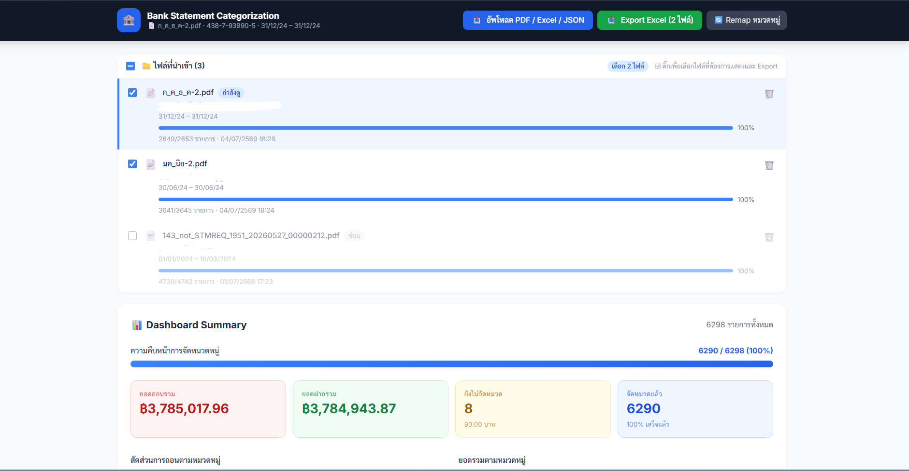
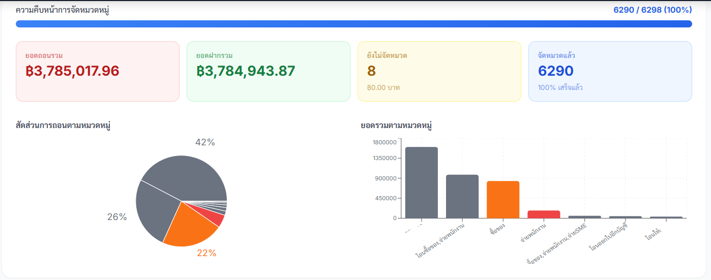
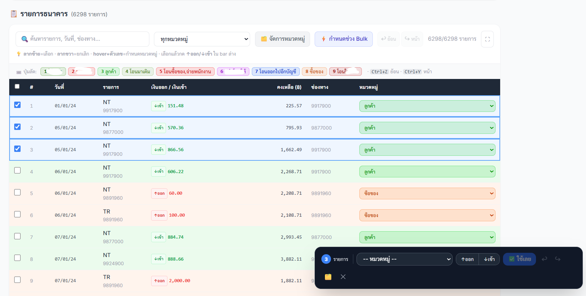

# Bank Statement Categorization Bank-PDF-Manament-WebUI-Export-Excel

Web app สำหรับนำเข้า PDF Bank Statement → จัดหมวดหมู่รายการ → Export Excel

**Tech Stack:** FastAPI + SQLAlchemy (SQLite) + pdfplumber + React (Vite) + Tailwind CSS + Recharts  
**Single-port:** FastAPI serve React build บน port เดียว (`http://localhost:8000`)
---




---

## ติดตั้งและรัน

### Prerequisites
- Python 3.10+
- Node.js 18+

---

### Backend

```bash
cd backend

# สร้าง virtual environment
python -m venv venv

# Activate (Windows)
venv\Scripts\activate

# Activate (macOS/Linux)
source venv/bin/activate

# ติดตั้ง dependencies
pip install -r requirements.txt

uvicorn main:app --reload --port 8000
```

### Frontend

```bash
cd frontend

# ติดตั้ง dependencies
npm install

# Build สำหรับ production (FastAPI จะ serve ไฟล์นี้)
npm run dev
```

---

เปิดที่ **http://localhost:8000**  
API Docs: **http://localhost:8000/api/docs**

---

###  Next Starter
Terminal 1 — Backend:
```bash
cd backend
venv\Scripts\activate
uvicorn main:app --reload --port 8000
```

Terminal 2 — Frontend:
```bash
cd frontend
npm run dev
```

---

###  Productions Build Run
Terminal 1 — Backend:
```bash
cd backend
venv\Scripts\activate
uvicorn main:app --reload --port 8000
```

Terminal 2 — Frontend:
```bash
cd frontend
npm run build
npm start
```

---

## Features

| Feature | รายละเอียด |
|---------|-----------|
| 📄 PDF Upload | รองรับ KTB Bank Statement (ธนาคารกรุงไทย), Excel (.xlsx/.xls), CSV |
| 💾 Auto-save | บันทึกหมวดหมู่ลง SQLite ทันทีเมื่อเปลี่ยน (debounce 400ms) |
| 🔄 Resume งาน | ปิด browser แล้วกลับมาทำต่อได้ — ข้อมูลยังอยู่ครบ |
| 🗂️ Multi-session | import หลายไฟล์ สลับดูแต่ละไฟล์ได้อิสระ |
| ✅ Bulk categorize | เลือกหลายแถว → apply หมวดหมู่ทีเดียว |
| 📊 Dashboard | progress bar + stat cards + Pie/Bar chart (Recharts) |
| 📥 Export Excel | cell coloring ตามหมวดหมู่ + Summary sheet |
| 🔍 Search & Filter | ค้นหาข้อความ + filter ตามหมวดหมู่ + sort ทุก column |

---

## โครงสร้างโปรเจกต์

```
backend/
├── main.py          # FastAPI app + serve React static files
├── models.py        # SQLAlchemy: UploadSession, Transaction, CategoryConfig
├── schemas.py       # Pydantic schemas
├── crud.py          # Database operations
├── pdf_parser.py    # KTB PDF parsing (pdfplumber)
├── database.py      # SQLite connection
└── requirements.txt

frontend/
├── src/
│   ├── App.jsx                   # Main app + session management
│   ├── api.js                    # Axios client (/api/...)
│   └── components/
│       ├── SessionList.jsx        # รายการไฟล์ที่ import + resume
│       ├── StatementGrid.jsx      # ตารางรายการ + auto-save + bulk
│       └── DashboardSummary.jsx   # Charts + stats
└── dist/                         # (generated) React build → FastAPI serve
```

---

## หมวดหมู่ default

| หมวดหมู่ | สี |
|---------|-----|
| จ่ายพนักงาน | 🔴 แดง |
| ซื้อของ | 🟠 ส้ม |
| ค่าสาธารณูปโภค | 🟡 เหลือง |
| รายได้ | 🟢 เขียว |
| โอนเงิน | 🔵 น้ำเงิน |
| ค่าใช้จ่ายทั่วไป | 🟣 ม่วง |
| Uncategorized | ⚫ เทา |
